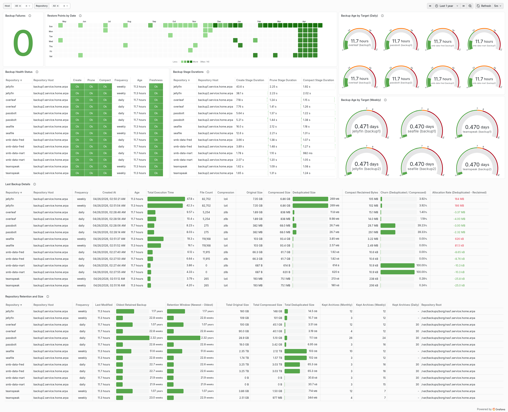

# Cyborg Workflow Engine

Cyborg is a .NET 10 workflow engine for declarative, unattended orchestration on Linux. Workflows are immutable JSON module trees that are prepared through source-generated defaults, runtime overrides, interpolation, and validation before execution. The application publishes as a self-contained native AOT binary, and the included Borg module library provides a production-oriented backup orchestration stack on top of the domain-agnostic core.

## Overview

Cyborg treats orchestration as composition rather than scripting. Built-in modules provide sequencing, conditionals, loops, subprocess execution, environment manipulation, external configuration, and reusable templates; domain-specific libraries can add further modules without changing the runtime model. Scoped environments provide late-bound variables and overrides between modules, while artifacts publish structured results back into the workflow.

Key capabilities:

- **Composable declarative workflows** — Build nested execution trees from versioned JSON modules instead of procedural glue scripts, using built-in sequencing, conditionals, loops, subprocess execution, and environment manipulation as reusable building blocks.
- **Reusable templates and late binding** — Parameterize common workflow structures, inject typed data or modules, and resolve scoped variables, artifacts, interpolation expressions, and per-module overrides at execution time.
- **Predictable preparation and validation** — Defaults, overrides, interpolation, and recursive validation are applied before execution; source-generated code keeps this pipeline AOT-compatible without runtime reflection.
- **Built-in diagnostics stack** — Structured logging, Prometheus metrics, prepared-module inspection, breakpoints, and the interactive debugger provide a consistent operational view across unattended workflows.
- **Secret-aware textual data flow** — `TaggedString` metadata propagates through Cyborg-managed text flow so diagnostics and other presentation surfaces can redact `cyborg.secret.v1` values while explicit execution boundaries retain access to the raw value.
- **Native AOT and configuration trust** — Publish as a self-contained binary without a .NET runtime dependency and audit configuration ownership/permissions before deserializing executable workflow definitions.
- **Production-oriented Borg orchestration** — The included Borg module library and reference deployment coordinate create/prune/compact workflows, remote-host lifecycle, retention, diagnostics, and metrics on top of the same domain-agnostic engine.
- **First-class module extensibility** — Every unit of work is a module, from subprocess calls and control flow to domain-specific orchestration. Custom module libraries compose with the built-ins and participate in the same environment, preparation, validation, diagnostics, and execution model without changing the core engine.

## Use Cases

Cyborg's core engine is domain-agnostic — any workflow that can be expressed as a composition of subprocess calls, conditionals, loops, and environment variable passing can be orchestrated through JSON configuration. The included `Cyborg.Modules.Borg` library provides a ready-made solution for BorgBackup orchestration.

### BorgBackup Orchestration

The [`samples/`](samples/) directory contains a production-ready reference deployment that orchestrates BorgBackup across multiple remote repositories with Wake-on-LAN for cold backup targets, automatic service lifecycle management (Docker and systemd), retention policy enforcement, and Prometheus metrics with a Grafana dashboard.



See the [samples README](samples/README.md) for the full walkthrough, configuration reference, and setup guide.

## Getting Started

### Prerequisites

- Docker (for containerized builds), or .NET 10 SDK (for building from source)
- For borg workflows: BorgBackup installed on the backup host(s) and SSH access to remote repositories

### Building

**Using the build script** (recommended):

```bash
# Build inside Docker and output to Source/artifacts/
Source/docker-build.sh

# Build and output to a custom directory
Source/docker-build.sh -o /usr/local/bin
```

**Manually with Docker**:

```bash
docker build --target artifact --output type=local,dest=./dist Source/
```

**Manually with the .NET SDK**:

```bash
cd Source
dotnet publish Cyborg.Cli/Cyborg.Cli.csproj \
    --configuration Release \
    --runtime linux-x64 \
    --self-contained true
```

Build artifacts are output to `Source/artifacts/`.

### Configuration

Cyborg is configured through jconf files, which are JSON with support for comments. Host configuration is stored as dot-delimited hierarchical leaf keys and composed in three precedence layers: CLI-defined built-in defaults, the options file, then explicit `--config` command-line overrides. Structured source values are decomposed before storage, so later layers replace earlier values at the same leaf without retaining stale parent objects. Typed dynamic values use the same `key[:type]=value` model in configuration and CLI inputs; `cyborg.types.secret.v1` produces a secret-tagged textual value whose metadata is preserved through Cyborg-managed interpolation and diagnostics.

Cyborg expects its configuration in `/etc/cyborg/` by default. The `samples/` directory provides a complete reference configuration:

| File | Purpose |
|------|---------|
| `cyborg.jconf` | Main workflow entry point — defines the top-level module to execute |
| `cyborg.options.jconf` | Runtime options: logging, metrics, trust policies, debugger frontend |
| `cyborg.hosts.jsecrets` | Host definitions and secrets (borg passphrases, SSH settings, WoL MACs) |
| `jobs/` | Per-frequency job definitions (daily, weekly) |
| `templates/` | Reusable workflow templates (Docker backup, systemd backup) |

Copy the sample files to `/etc/cyborg/`, adjust host definitions and secrets for your environment, and ensure configuration files are owned by root with restrictive permissions (see [Security](#security) below).

Interactive debugging uses a keyed frontend selected through runtime configuration. The CLI's built-in defaults select the registered `console` frontend; the options file or a later `--config cyborg.core.debug.frontend=...` override can select another registered frontend without changing the core debugger.

### Running

```bash
# Execute the daily backup target
cyborg run -e target=daily

# Execute with a custom configuration path
cyborg run --main /path/to/cyborg.jconf -e target=daily

# Override the console log level
cyborg run -e target=daily --log-level information

# Override a frontend selected by the options file for this invocation
cyborg run -e target=daily --config cyborg.core.debug.frontend=console

# Override a configuration leaf for this invocation
cyborg run -e target=daily --config cyborg.services.metrics.file_path=/tmp/cyborg.prom

# Override an enum-valued configuration leaf through its registered dynamic value type
cyborg run -e target=daily --config 'cyborg.services.logging.minimum_level:cyborg.types.services.logging.level.v1="debug"'

# Break before a named module and open the selected debug frontend
cyborg run -e target=daily --break-at 'my-step-name'
```

When `--break-at` is set, execution pauses after the matching module has been prepared and its constraints evaluated, but before validation is enforced and before the worker runs. With the `console` frontend selected, the debug REPL supports `continue`, `step`, `inspect`, breakpoint management, and `cancel`. See [Workflow Debugging](docs/architecture/debugging.md).

The `target` environment variable selects which job to run (e.g., `daily`, `weekly`). Additional environment variables can be injected via `-e` with optional type annotations (e.g., `-e port:int=2222`). Host configuration can be overridden with `-c` / `--config` using `key[:type]=value`. Configuration hierarchy uses dots, while the optional single-colon suffix identifies a registered dynamic value provider. Untyped values are literal strings; typed values are parsed as JSON. Multiple definitions use the option's array input: comma-separated definitions are convenient for simple values, while JSON-array syntax preserves definitions that themselves contain commas. Structured typed inputs are decomposed into their leaf keys before entering the configuration store.

## Configuration Model

Workflows are defined as JSON files using versioned module IDs and snake_case property names:

```json
{
  "module": {
    "cyborg.modules.sequence.v1": {
      "steps": [
        {
          "module": {
            "cyborg.modules.subprocess.v1": {
              "command": { "executable": "/usr/bin/borg", "arguments": ["create", "::daily"] }
            }
          }
        }
      ]
    }
  }
}
```

Each module invocation is wrapped in a `ModuleContext` envelope that can declare environment scoping, configuration modules for variable injection, and pre-execution requirements. Modules compose arbitrarily — a sequence can contain conditionals, each branch can run loops over parameterized templates, and templates can reference external configuration files.

For details on the configuration model and all available modules, see the [Module Reference](docs/architecture/modules-reference.md).

## Security

Cyborg treats configuration integrity and secret presentation as separate boundaries. The trust subsystem audits file ownership and permissions before executable configuration is deserialized; the default policy requires configuration files to be owned by root and not writable by group or other users. Trust enforcement is configurable in `cyborg.options.jconf` as `enforce`, `log_only`, or `disabled`.

Sensitive textual values should enter the runtime as `TaggedString` values, normally through `cyborg.types.secret.v1` or a `[Secret]` module property. Secret tags survive interpolation and override selection, and Cyborg-controlled diagnostics, debugger output, and tagged metric labels render them through the shared redaction policy. Raw values are exposed only at explicit execution or compatibility boundaries such as child-process dispatch.

See [Security Design Principles](docs/architecture/architecture-overview.md#security-design-principles) and [Tagged Textual Values](docs/architecture/architecture-overview.md#tagged-textual-values) for the runtime contracts.

## Documentation

| Document | Description |
|----------|-------------|
| [Architecture Overview](docs/architecture/architecture-overview.md) | System architecture: module system, runtime, environment scoping, parsing, security |
| [Module Reference](docs/architecture/modules-reference.md) | Complete documentation of all built-in modules |
| [Dynamic Values Reference](docs/architecture/dynamic-values-reference.md) | Dynamic value providers, typed configuration, tagged strings, and secret values |
| [Interpolation and Overrides](docs/architecture/interpolation.md) | Expression syntax, evaluation phases, override selection, and deferred interpolation |
| [Templates Reference](docs/architecture/templates-reference.md) | Template module usage and patterns |
| [Source Generators](docs/architecture/source-generators.md) | Roslyn source generators for AOT-compatible code generation |
| [Validation Attributes Reference](docs/architecture/validation-attributes-reference.md) | Validation, defaulting, override, interpolation, and secret-tag attributes |
| [Workflow Debugging](docs/architecture/debugging.md) | Breakpoints, interactive REPL, module descriptions, and inspection |
| [Module Testing](docs/architecture/module-testing.md) | Production-backed module test infrastructure and generator fixtures |
| [Metrics](docs/metrics.md) | Global and module metric output |

## Project Structure

```
Source/
  Cyborg.Cli/             Application entry point and CLI composition
  Cyborg.Cli.Debugging/   Console debugger frontend and isolated REPL routing
  Cyborg.Core/            Runtime, modules, environments, configuration, and services
  Cyborg.Core.Aot/        Roslyn source generators for AOT-compatible generated code
  Cyborg.Shared/          Source-shared utilities used by both runtime and analyzer projects
  Cyborg.Core.TestAdapter/ Production-backed module test harness
  Cyborg.TestModules/     Source-generator fixture models
  Cyborg.Modules/         Built-in domain-agnostic modules
  Cyborg.Modules.Borg/    Borg-specific modules and parsers
samples/                   Reference deployment, configuration, and templates
docs/                      Architecture and reference documentation
```

## Extending Cyborg

Cyborg's architecture separates the domain-agnostic engine (`Cyborg.Core`, `Cyborg.Modules`) from domain-specific module libraries (`Cyborg.Modules.Borg`). Cyborg is licensed under the MIT License. To adapt Cyborg for a different orchestration domain, fork the repository and replace or extend the domain-specific layer:

1. **Create a new module library** — Add a project alongside or in place of `Cyborg.Modules.Borg`. Each module follows the three-part pattern (module record, worker, loader) described in the [Architecture Overview](docs/architecture/architecture-overview.md#three-part-module-pattern). Annotate the module record with `[GeneratedModuleValidation]` and the loader with `[GeneratedModuleLoaderFactory]` to have the source generators produce the validation pipeline and deserialization factory.

2. **Register modules via a service interface** — Expose a Jab `[ServiceProviderModule]` interface that registers your module loaders (as `IModuleLoader` singletons), dynamic value providers, and any supporting services. This follows the same pattern as `ICyborgBorgServices`.

3. **Import into the CLI composition root** — Add an `[Import<IYourModuleServices>]` attribute to `DefaultServiceProvider` in `Cyborg.Cli` and register any additional `JsonSerializerContext` instances required by your module types.

4. **Provide JSON configuration** — Define workflow files using your module IDs. All engine-level modules (sequence, if/else, foreach, template, subprocess, guard, etc.) remain available and compose freely with custom modules.

The core engine, built-in flow-control modules, environment scoping, variable resolution, override system, and validation infrastructure require no modification. Custom modules participate in all of these subsystems automatically through the source-generated interfaces.

## License

This project is licensed under the MIT License. See [LICENSE](LICENSE) for details.
