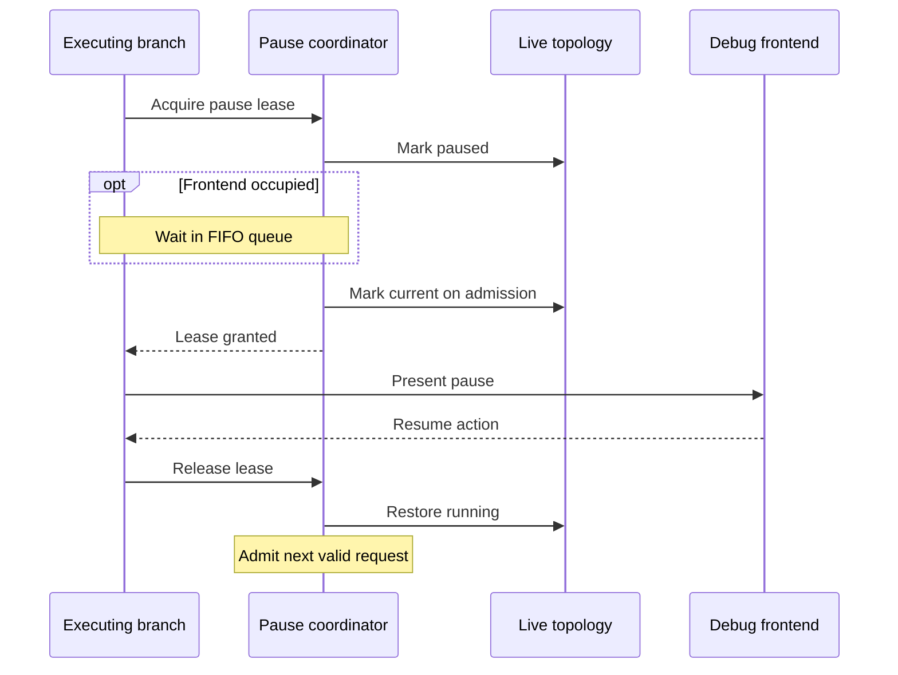

# Workflow Debugging and Module Descriptions

This document describes the workflow debugging subsystem and the format-neutral module-description pipeline used by debugger inspection and other presentation clients.

For the surrounding invocation, transaction, and lifecycle model, see [Architecture Overview](architecture-overview.md) and [Transactional Execution](transactions.md). For the source generation that produces rich module descriptors, see [Source Generators](source-generators.md).

## Overview

Cyborg debugging operates at prepared module execution boundaries. A breakpoint is evaluated after defaults, override resolution, interpolation, and constraint evaluation have produced an `IValidationResult<TModule>`, but before that result is enforced and before the worker executes. The debugger can therefore inspect the prepared module together with any validation errors, including configurations that would fail normal execution.

The debugger combines four kinds of state with deliberately different ownership:

- persistent breakpoint expressions are process-wide debugger-session state;
- step and step-over state follow the transaction branch of the paused invocation;
- the live execution topology is a Core-owned projection of currently open structured module invocations;
- frontend ownership is serialized by a debugger pause coordinator so only one interactive frontend session is active at a time.

`Cyborg.Core` owns these runtime mechanics and exposes frontend-neutral pause state through `IDebugFrontend` and `IDebugPauseContext`. `Cyborg.Cli.Debugging` provides the console frontend, command surface, and text rendering for execution trees and ancestry. `Cyborg.Cli` is the host composition root: it registers the CLI debugger services and selects runtime configuration sources.

Module descriptions remain independent of debugger control. `IModuleDescriptionSerializer` is the format extension boundary, so applications can register additional output formats through DI and reuse the same descriptor tree outside a debugging session.

## Execution Boundary and Identity

Every runtime-owned module invocation carries a stable `ModuleExecutionId` and an optional parent execution ID. All runtime views that belong to the same invocation reuse that identity. Nested execution creates a child identity from the structured caller rather than inferring ancestry from a CLR thread, `AsyncLocal<T>`, or runtime-object discovery.

The runtime exposes general-purpose lifecycle events independently of the module validation and execution hooks. An invocation progresses through the following boundaries in order, although validation failures and other early exits may prevent later execution stages from being reached:

1. **Establish the invocation.** Create its transaction and DI scope, assign its execution identity and optional parent ID, and emit `Started` before any module preparation. This allows observers to see invocations that fail before the debugger's pre-execution boundary.
2. **Prepare and validate.** Resolve the invocation environment, requirements, and any configuration module before preparing the main module through defaults, overrides, interpolation, constraint evaluation, and validation hooks.
3. **Enter pre-execution hooks.** Give the debugger access to the prepared module and validation result before validity is enforced or the worker runs. A debugger cancellation can end the invocation without executing the worker.
4. **Execute the module.** Enforce validation and, if execution proceeds, invoke the worker and post-execution hooks.
5. **Complete and reconcile.** Emit `Completed` if a definite result exists, then reconcile the transaction under its publication policy. An invocation that ends without a definite result is discarded instead; no `Completed` event is emitted.
6. **Close the invocation.** Emit `Closed` after reconciliation or discard, when the invocation leaves the live topology, and dispose its scope after its structured child work has terminated.

Lifecycle-observer failures are logged without changing module results, transaction reconciliation, or delivery to other observers. The debugger participates through the normal pre-execution hook, but frontend actions are applied centrally by `WorkflowDebugger`: `Continue` resumes execution, `Cancel` produces a canceled result, and `Step`, `Next`, and `Detach` update debugger control without requiring the frontend to manipulate transactional state.

## Breakpoints and Branch-Scoped Stepping

`IBreakpointRegistry` stores numbered regular-expression breakpoints. Expressions are culture-invariant and matched against the module ID plus `Name` and `Group` when present. Persistent breakpoints are global across execution branches and remain registered until explicitly removed or detached. The registry also supports one-shot expressions as a general feature, but built-in stepping does not use a wildcard breakpoint.

Persistent expressions are evaluated in breakpoint-ID order. One-shot expressions are evaluated first, newest first, and a matching one-shot is atomically consumed by the caller that wins its removal. A persistent expression remains registered after a match. Regular-expression matching has a bounded timeout; a timeout pauses execution with a debugger diagnostic rather than failing the workflow. A timed-out persistent expression remains registered, while a one-shot is consumed when its evaluation causes that pause.

| Expression | Meaning |
|---|---|
| `step-two` | Substring match against ID/name/group |
| `^step-two$` | Exact name/group match |
| `cyborg\.modules\.empty\.v1` | Match the empty module ID |
| `.*` | Match every module |

At each prepared module boundary, the debugger may pause for any of three reasons: a persistent or one-shot breakpoint matches (or produces a diagnostic that requires inspection), step-into is armed on the invocation's branch, or step-over is armed and its anchor is not an open strict ancestor of the current invocation. These conditions are independent, so a breakpoint inside a stepped-over subtree still takes effect.

There is no process-wide `IsEnabled` mirror for branch control. The pre-execution hook reads the transaction-scoped `IDebugBranchControl` from the current invocation provider, and it consults the live execution topology for ancestry only when an active step-over anchor requires it. Sessions that never issue `next` avoid that lookup.

### Branch-local stepping and reconciliation

Step-into and step-over are execution-control state attached to the current transaction branch, not process-wide breakpoints. A child inherits the branch's control state when it forks, while parallel siblings receive isolated copies that remain independent until their common join. With step-into armed, the next prepared invocation on the branch pauses, including a nested, dynamic, or otherwise conditionally selected child.

Every explicit `step`, `next`, or `continue` command receives a monotonically increasing sequence from the shared debugger session. At a fork join, control-state reconciliation considers contributors from the newest session generation represented in that fork and selects the state with the highest command sequence. The owner continuation and child branches follow the same rule, regardless of creation or completion order. Untouched branches inherit equivalent control state and sequence values, so they cannot override a newer command; equal sequences with different control states violate an internal invariant. A later `continue` therefore overrides an earlier sibling `step`, just as a later `step` overrides an earlier `continue`.

This isolation also applies to workflow rollback: the debugger is a control participant, so a completed child's command is reconciled even when that child's workflow-data changes are rolled back. An invocation discarded without a definite result publishes neither workflow data nor debugger control state. Breakpoint evaluation remains global and may independently pause a sibling before convergence, without changing that sibling's inherited branch control.

### Step-over with `next`

Issuing `next` clears step-into and records the paused invocation's `ModuleExecutionId` as an anchor. As long as that invocation remains open, its descendants are inside the anchored subtree and do not pause solely for step-over. The anchor follows subsequent child forks and joins until the first prepared module outside the subtree: normally the next sequential sibling, or a successor on an ancestor's branch after the anchored invocation closes. Because the successor is identified through open ancestry rather than predicted in advance, the same behavior applies to dynamic calls, conditions, and loops. Stepping over a loop invocation runs its child invocations without step-over pauses and stops at the loop's successor; stepping over a child inside the loop proceeds to the next eligible invocation in the loop.

A `next` issued in one parallel child cannot pause an unrelated sibling while the fork remains open. Once the branches join, the normal command-sequence reconciliation determines what control state the parent resumes with, including commands issued at breakpoints inside an otherwise stepped-over subtree. A breakpoint hit does not itself clear the anchor: the frontend's subsequent resume action controls whether the pending step-over continues. `step` replaces it with step-into, while `continue` and `cancel` clear both modes; issuing another `next` replaces the anchor. A non-runtime pause without an execution ID cannot identify a subtree, so choosing `next` there clears branch control instead of implicitly arming step-into.

The session generation fences branch control across `detach`. Detaching clears global breakpoints, advances the shared generation, and clears the current branch; previously copied control state may still reconcile within other open forks but is hidden by generation-checked reads and cannot reactivate stepping. The command sequence orders decisions within a session, whereas the generation determines whether those decisions are still valid.

## Pause Coordination

Parallel branches independently evaluate breakpoints and branch-control state at their prepared-module boundaries. Once a branch decides to pause, it requests exclusive frontend ownership; the pause remains visible in the live topology even if another branch currently owns the interactive session.



The coordinator admits requests and releases frontend ownership under the same synchronization boundary, ensuring that a pause arriving during a resume cannot be lost between queue inspection and admission. At most one branch owns the frontend, while other paused branches continue to wait in FIFO order.

Removing a breakpoint cannot undo a pause already decided by a branch. `Detach` instead invalidates the debugger session, clearing global breakpoints and effective branch-control state while suppressing queued pauses from the old session generation. Cancellation of a queued execution removes that request and restores its running topology state without blocking later requests.

## Live Execution Topology

`IDebugExecutionTopology` is the read-only Core boundary for the debugger's current logical execution topology. It is populated by the general execution-lifecycle observer and keyed by explicit `ModuleExecutionId` values.

A node is created on `Started`, before generated preparation or pre-execution hooks are required to succeed. The debugging pre-execution hook enriches the node with the prepared module's final `Name` and `Group` when that boundary is reached. `Completed` records the exit status but retains the node until `Closed`, which means a completed parallel sibling remains visible while other siblings are still open. `Closed` removes the invocation from the live topology.

The topology is deliberately a current-state model, not a trace. Once a structured invocation closes, its node is pruned. Consumers that require execution history should build that concern as a separate lifecycle observer rather than keeping closed debugger nodes indefinitely.

Open nodes expose these states:

| State | Meaning |
|---|---|
| `running` | The invocation is active and has not produced a definite result |
| `completed: <status>` | A definite result exists, but the structured invocation has not closed yet |
| `paused` | The invocation decided to pause and is waiting for frontend ownership |
| `paused/current` | The invocation currently owns the frontend session |

`CaptureTree()` returns an immutable point-in-time forest of open invocations. `CaptureAncestry(executionId)` returns the selected invocation followed by its explicit logical ancestors up to the root. These projections do not expose the mutable internal topology.

## Frontend Boundary

The host-facing frontend contract remains small:

```csharp
public interface IDebugFrontend : IKeyedService
{
    ValueTask<DebugResumeAction> PauseAsync(IDebugPauseContext context, CancellationToken cancellationToken);
}
```

Frontend selection uses the keyed-service setting `cyborg.core.debug.frontend`. Core has no implicit frontend (`DebugOptions.Default.Frontend` is `null`) because presentation policy belongs to the host. `Cyborg.Cli.Debugging` registers the built-in `console` frontend, while the CLI composition root supplies `console` as its host default; ordinary configuration sources can replace that selection.

A frontend may return any of the following dispositions:

| Action | Meaning |
|---|---|
| `Continue` | Clear step-into and step-over on the current branch and resume |
| `Step` | Clear step-over and resume with the current branch left in step-into mode |
| `Next` | Clear step-into, arm step-over at the paused invocation, and resume |
| `Cancel` | Clear step-into and step-over, and cancel the current module before worker execution |
| `Detach` | End the debugger session, clear breakpoints, invalidate branch-local debugger state, and resume |

`IDebugPauseContext` exposes the state that is valid while the frontend owns a pause:

| Member | Purpose |
|---|---|
| `ModuleId` | Canonical versioned ID of the paused module |
| `ExecutionId` | Stable logical invocation ID when the context belongs to runtime execution |
| `ValidationResult` | Prepared module, validity state, and validation errors |
| `Runtime` | Runtime associated with the paused execution boundary |
| `Services` | Invocation service provider used as the fallback for frontend command DI |
| `Breakpoints` | Global debugger-session breakpoint registry |
| `Diagnostics` | Debugger-side diagnostics associated with entering this pause |
| `Tree` | Fresh immutable snapshot of all currently open logical executions |
| `Stack` | Fresh immutable ancestry projection for the paused execution |

Runtime-provided pause contexts capture `Tree` and `Stack` on each access. A long-running frontend can therefore observe siblings that progress from running to paused or completed while the current session remains open. Custom contexts that are not attached to a runtime invocation can expose no execution ID and use the empty default projections.

The frontend does not mutate transactional stepping state directly. This keeps presentation adapters independent from transaction mechanics and gives `WorkflowDebugger` one place to apply resume actions, session invalidation, and branch-control changes.

## Console REPL and CAF Isolation

`ConsoleDebugFrontend` owns the interactive pause lifecycle: display the pause state and debugger diagnostics, read a prompt-aware command line through `IDebugReplIo`, dispatch it, and continue until a command returns a resume action. EOF returns `Detach`, allowing the workflow debugger to perform the same centralized session cleanup as the explicit command. Inspection serializes the prepared module descriptor and then reports associated validation errors.

The console frontend uses ConsoleAppFramework (CAF) for command routing, aliases, argument binding, validation, generated help, and command dependency injection. Cyborg retains only a lexical tokenizer because an interactive REPL receives one input string while CAF consumes an argument vector. Quoting and escaping are handled before CAF dispatch, while command grammar remains CAF-owned.

The process CLI and debugger command surfaces live in separate compilations:

`Cyborg.Cli` owns the process-level CAF commands, such as `run`, while `Cyborg.Cli.Debugging` defines the debugger-only commands, such as `continue`, `step`, `next`, `tree`, `stack`, and `break`. Each command surface is compiled separately, so they cannot accidentally share command routing or help output.

This isolation prevents debugger help and routing from exposing or recursively invoking process-level commands. During one debugger command dispatch, pause-local objects are layered over the invocation service provider so command classes can receive both kinds of dependencies through constructor injection.

`IDebugReplIo` is the console presentation extension boundary. It owns prompt-aware reads and semantic writes classified by `OutputKind` (`Text`, `Status`, `Success`, `Warning`, and `Error`). Core topology objects carry no text-formatting policy; `ExecutionTreeFormatter` and the `tree`/`stack` commands live in `Cyborg.Cli.Debugging`.

### Built-in commands

| Command | Aliases | Behavior |
|---|---|---|
| `continue` | `c`, `resume` | Clear step-into and step-over on this branch and resume until another breakpoint or step boundary |
| `step` | `s` | Resume with this execution branch in step-into mode |
| `next` | `n` | Execute the paused module without stepping into its nested modules, then break at the next module on this branch |
| `detach` | none | End the debugger session and resume execution |
| `cancel` | `q`, `quit` | Cancel the paused module before its worker executes |
| `inspect` | `i` | Serialize the prepared module descriptor and print associated validation errors |
| `tree` | none | Render the current live logical execution tree |
| `stack` | none | Render the current invocation followed by its logical ancestors |
| `break at <expression>` | `b at ...` | Add a persistent breakpoint |
| `break ls` | `break list`, `b ls`, `b list` | List breakpoints |
| `break rm <id>` | `break remove`, `b rm`, `b remove` | Remove one breakpoint |
| `help [command]` | `h`, `?` | Display CAF-generated debugger help |

`tree` distinguishes running, completed-but-open, queued paused, and current paused invocations. `stack` numbers frames from the current invocation (`#0`) toward the root. Empty views are rendered explicitly rather than as blank output.

## Module Identity and Descriptor Capability

`IModule` defines the runtime identity and inspection surface shared by all modules: `Name`, `Group`, and `GetDescriptor()`. `IModuleDefinition` adds the static versioned `ModuleId` used for loading and execution. Short identity strings combine these values for diagnostics, breakpoint banners, and topology rendering without relying on the concrete module type.

Descriptor support is therefore not an optional debugger-only capability. Generated module records return their rich generated descriptor from `GetDescriptor()`, while `ModuleBase` supplies a minimal fallback containing CLR type, name, and group for hand-written modules. Consumers such as `inspect` can always request a descriptor and do not need to special-case whether a module implements a separate capability interface.

## Module Description Pipeline

### Descriptor contract

`IModuleDescriptor` is the format-neutral producer contract:

```csharp
public interface IModuleDescriptor
{
    ValueTask DescribeAsync(IObjectDescriptionBuilder descriptionBuilder, CancellationToken cancellationToken);
}
```

Descriptor production is asynchronous and cancellable at the contract boundary. Generated descriptors populate the supplied builder directly; nested builder callbacks remain synchronous because tree construction itself does not require an asynchronous callback model.

### Tree construction and service ownership

`IModuleSerializationService` owns construction and serialization. It asks the descriptor to populate an object builder, materializes an immutable `IDescriptionObjectComponent` tree, and then delegates output to an `IModuleDescriptionSerializer`. Serializers can be supplied directly or resolved by format through `IModuleDescriptionSerializerRegistry`.

The public extension surface includes the descriptor/builder contracts, immutable description-component interfaces, the component writer abstraction, serializer and registry contracts, and `IModuleSerializationService`. Concrete mutable builders and built-in serializer implementations remain internal. This keeps tree construction controlled by the core service while allowing external serializer implementations to consume the stable immutable model.

Description services are registered independently from debugger services. Applications can therefore render module descriptions without enabling breakpoint infrastructure. Multiple `IModuleDescriptionSerializer` implementations may be registered; format keys are unique case-insensitively. Built-in text and JSON formats use `text/plain` and `application/json` and are resolved through the same registry as custom formats.

### Hints

Description properties and values may carry `ImmutableArray<string>` hints. Hints are arbitrary metadata keys with no mandatory semantics in the description tree. The tree preserves them for custom serializers and other downstream consumers. Built-in serializers do not reinterpret hints as tagged-value metadata, keeping presentation hints separate from taint state.

`TaggedString` values are first-class atoms. Built-in text and JSON serializers render their runtime tags through `ITaggedStringRenderer`; a value carrying `cyborg.secret.v1` is therefore written as `[REDACTED]` rather than the raw secret. `[Secret]` establishes that tag during generated preparation, so debugger and validation inspection of prepared modules relies on the same tagged value state used by every other Cyborg presentation surface.

### Source-generated traversal

The module-validation generator emits rich descriptor traversal from the same property model used for validation, defaults, overrides, typed value expressions, and interpolation. Nested `[Validatable]` records and supported collections are therefore described with the same structural classification used by the preparation pipeline, without runtime reflection.

The shared collection rules matter for descriptor correctness as well as validation: `string` remains a scalar despite implementing `IEnumerable<char>`; absent nullable collections are not enumerated; and a default `ImmutableArray<T>` remains distinct from an initialized empty array. Accessibility checks are evaluated relative to the lexical context of the generated partial module, including recursively reached nested or inherited properties.

## DI Composition

Core registration is separated by responsibility:

`ICyborgCoreServices` imports `IModuleDescriptionServices` for descriptor construction, serializers, the format registry, and serialization, and `IDebugServices` for the breakpoint registry, shared session state, transaction-aware branch control, workflow debugger, pause coordination, topology, and runtime hooks. The separate `ICyborgCliDebugServices` module registers console REPL I/O, the keyed frontend, CLI breakpoint integration, and the `tree`/`stack` command and rendering surface.

The execution lifecycle observer is a general runtime extension point; only the registered topology observer is debugger-specific. Transaction participation is likewise provided by the generic transaction-aware service infrastructure, while the debugger defines only its branch-state merge semantics.

This split keeps runtime observation/control, module-description serialization, and host presentation independently replaceable. Core defines execution identity, current-state projections, and debugger orchestration; the CLI debugger assembly owns console-specific behavior; the application composition root decides which frontend and configuration sources are active.

## Testing Expectations

Debugger tests should preserve architectural boundaries rather than merely command implementations. Core coverage owns execution identity/lifecycle ordering, topology snapshot semantics, branch-control fork/join rules for both step-into and step-over, pause-coordinator FIFO/cancellation/session invalidation, breakpoint evaluation diagnostics, and workflow-debugger action application. CLI coverage owns command registration, aliases/tokenization, tree/stack rendering, prompt-aware I/O, semantic output categories, inspection, and EOF behavior.

Production-flow integration coverage should exercise the same model through real control-flow modules: sequential and dynamic nested calls, parallel descendant stepping, independent sibling step/continue/next decisions, global breakpoint hits alongside branch-local stepping and step-over, join restoration after all/some descendants continue, `next` stopping at a sibling or at an ancestor's successor, breakpoints inside a stepped-over subtree, detach overriding a pending `next`, failures before the main debugger boundary, and forced queued-pause detach/cancellation scenarios. Fork/join coverage should explicitly verify that the newest stateful debugger command wins across sibling branches, including pure `step`/`continue` cases that do not involve `next`.

Module-description coverage should exercise generated scalar/nested/collection traversal, nullable and default collection shapes, hint preservation, tagged-value rendering, custom serializer registration, and cancellation.
