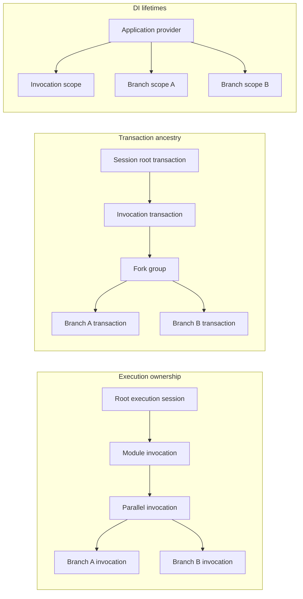

# Transactional Execution

Cyborg treats transactionality as a runtime execution primitive. Every module invocation runs in an isolated execution transaction and a fresh dependency-injection scope, regardless of whether the surrounding workflow is sequential or concurrent. Child state becomes visible to its caller only through an explicit structured join.

This model protects Cyborg-managed workflow state from scheduler-dependent mutation while keeping ordinary module code focused on control flow. `Sequence`, `ForEach`, `If`, `While`, `Guard`, configuration modules, named-module references, and `Parallel` all invoke the same runtime execution boundary; none of them implement their own environment snapshot or merge logic.

Transactions cover runtime-owned workflow state and services that explicitly opt into transactional participation. They do not roll back arbitrary external side effects, process-wide singleton state, or mutations inside object instances stored as environment values.

## Execution Ownership and Lifetimes

A loaded module graph contains immutable module definitions and activation metadata. It does not retain workers or scoped dependencies. When the runtime invokes a module, it establishes the invocation boundary before activating the worker:

1. fork a child transaction from the caller's current effective state;
2. create a fresh DI scope and bind transaction-aware scoped services to that child transaction;
3. bind the invocation's selected logical environment into the child transaction;
4. for a full `ModuleContext`, apply its named-module seed and requirements, then execute an optional configuration module as a nested invocation and reconcile it before the main worker is prepared;
5. activate a fresh worker from the invocation scope;
6. run generated preparation, validation, lifecycle hooks, worker execution, and artifact publication;
7. complete and reconcile the child transaction before the caller resumes;
8. dispose the invocation scope after all nested runtime-owned work has completed.

The transaction and DI scope solve different problems. The transaction owns inherited workflow state, isolation, and reconciliation. The DI scope owns service-object lifetime and dependency resolution. Scoped service instances are not inherited between module invocations, and DI scope ancestry is not used as transaction ancestry.

A module result status does not itself decide whether state is reconciled. `Success`, `Failed`, `Skipped`, and `Canceled` are execution results; ordinary nested execution still reconciles the completed child transaction unless execution fails before a join can be performed or reconciliation itself fails. Cyborg does not currently provide result-driven commit/rollback policy.

The following relationships coexist during execution and should not be conflated:

The diagram is only an ownership aid: module execution owns structured lifetime, transactions own state ancestry, and DI scopes own service instances.

## Root Executions

Each root runtime creates a parentless transaction from immutable execution seeds. The runtime environment participant seeds one logical global environment for that execution, while other participants seed their own root state. Multiple root runtimes created from the same application service provider may share ordinary singleton services, but their transaction-owned workflow state is independent.

`Global` therefore means global within one root execution tree, not process-global mutable workflow state. A root transaction has no implicit backing store to commit into when execution ends.

## Baselines, Changes, and Fork Groups

A transaction represents its effective state as a stable inherited baseline plus transaction-local changes. Forking captures the owner's current effective state without clearing or rebasing existing parent-relative provenance.

Explicit changes remain changes even when their final visible value happens to match the baseline. For map-like state, setting a key and later restoring its old value is still a write, and removing then restoring a key is still a modification. This provenance is required for deterministic conflict detection through nested execution.

A fork group freezes one baseline and creates ordered contributors from it:

- contributor `0` is the owner continuation;
- later contributors are child branches in creation order.

All sibling branches observe the same fork-time state. They cannot observe sibling writes or owner-continuation writes before the group joins. Branch completion timing does not change contributor ordering or reconciliation semantics.

Sequential nested execution uses the same model with one child branch. After that child joins, the caller's effective state includes the reconciled changes, so the next sequential child forks from the updated state.

## Reconciliation and Atomic Publication

Transactional state is split into participants. Each participant owns the semantics of one workflow-state concern, such as runtime environments, the runtime named-module registry, or a custom transaction-aware service. The transaction coordinator owns topology, contributor ordering, lifecycle, conflict-strategy dispatch, and aggregate publication.

Join is a prepare-then-publish operation:

1. every participant receives its completed contributor states and prepares a detached candidate;
2. participants report logical conflicts through the common conflict-strategy boundary;
3. no candidate is visible while preparation is in progress;
4. if every participant succeeds, the coordinator publishes one aggregate participant-state bundle;
5. if any participant conflicts or cannot prepare a candidate, no participant candidate is published and the owner resumes from its pre-fork state.

The default conflict strategy rejects conflicting writes to the same participant-defined logical key. Non-overlapping changes can reconcile together regardless of execution completion order. Aggregate publication also means a conflict in one participant prevents otherwise-valid changes in another participant from becoming visible.

The coordinator does not interpret environment paths, module names, or custom service keys. Participants define what constitutes a logical state location and how a detached candidate is constructed.

## Transactional Runtime State

### Environment graph

Runtime environments are transaction-owned logical nodes identified independently of the CLR environment objects exposed to workers. The environment participant owns:

- logical environment identities and parent relationships;
- named-environment registration;
- transient-environment reachability;
- variable bindings and explicit removals.

`IRuntimeEnvironment` instances are transaction-bound views over that state. Rebinding the same logical environment into another branch gives that branch a view backed by its own transaction state rather than a shared mutable dictionary.

Environment scope operations therefore retain their familiar workflow semantics while respecting transaction isolation. `Parent` and `Current` select an existing logical environment identity in the child transaction, `Reference` resolves a named logical environment visible to that transaction, and `Global` selects the root execution's logical global environment.

Environment values themselves remain opaque. Transactionality protects bindings such as `foo -> object`, not mutation performed inside the referenced object after it has been stored.

### Artifacts

Artifact publication writes through the current transaction's environment participant. A child's finalized artifacts are visible inside that child immediately, but parent or sibling visibility follows the same structured reconciliation rules as ordinary environment writes.

This prevents artifact targets such as `Parent`, `Current`, `Global`, and named references from bypassing isolation by reaching into another runtime object's mutable environment.

### Runtime named modules

Runtime named-module registrations are a separate transaction participant because module-name conflicts and registry state have different semantics from environment topology. Configuration loading produces immutable registry seeds; execution applies those seeds to the current transaction, and the scoped registry facade reads and mutates only the transaction-bound registry state.

A registration or removal is immediately visible in the transaction that performs it, invisible to siblings before join, and visible to the parent after successful reconciliation. A registry conflict participates in the same aggregate publication as environment changes, so a named-module conflict can prevent otherwise-valid environment changes from being published.

## Sequential and Parallel Composition

Sequential control-flow modules do not receive special transaction semantics. Each nested call opens a one-child fork from the caller's current state, executes the complete child invocation, joins it, and only then resumes the caller. This preserves the existing visibility behavior of configuration, artifacts, named references, and loop/conditional state while maintaining explicit change provenance.

`cyborg.modules.parallel.v1` is the multi-sibling execution surface. The runtime opens one fork group for all declared branch contexts, creates one child transaction and DI scope per branch, and starts the complete branch invocations concurrently. Every started branch is observed before reconciliation or disposal.

The runtime collects branch results in declaration order even when tasks complete in another order. Reconciliation also uses structural contributor order rather than scheduler completion order. If participant preparation succeeds, all compatible branch changes are published together. If reconciliation conflicts, the fork publishes nothing and `Parallel` fails.

Caller cancellation is propagated to all started branches, but cancellation does not allow the structured fork to abandon unobserved children. Branch scopes remain alive until the fork has joined or been discarded and are disposed afterward.

For the module's JSON contract and exit-status aggregation rules, see [Module Reference](modules-reference.md#parallel-cyborgmodulesparallelv1).

## Transaction-Aware DI Services

Ordinary DI lifetime does not imply transactional state. A scoped service is recreated for each invocation but is not automatically inherited or reconciled. A singleton is shared process-wide according to DI semantics and must provide ordinary thread safety when parallel workers can reach it.

A service whose state is part of workflow semantics can opt in through the public transaction-aware service extension surface:

- a singleton `TransactionalServiceParticipant<TState>` defines independent root-state construction and stable fork creation;
- a `TransactionalServiceFork<TState>` creates isolated branch state and prepares detached merge candidates;
- an ordinary scoped or transient service facade obtains an `ITransactionalServiceState<TState>` handle from `ITransactionalServiceContext`;
- the handle resolves the participant state currently owned by the invocation transaction on each read or mutation;
- logical conflicts are reported through `ITransactionalServiceConflictResolver`, allowing the runtime's conflict strategy to remain authoritative.

The participant descriptor defines state semantics but must not itself hold mutable workflow state shared across roots. The runtime remains responsible for transaction topology, participant ordering, branch lifecycle, and aggregate publication.

A facade may retain its state handle for its DI lifetime, including across nested child execution. It should not retain the raw state object passed to a handle callback because reconciliation may replace the participant state visible to the parent transaction.

## State Outside Transactions

Transactions intentionally do not virtualize every mutable thing a module can reach.

External I/O such as subprocess execution, network operations, or filesystem changes cannot be undone by environment reconciliation. A module that performs such work must use its ordinary failure semantics or a future compensating-action design.

Ordinary application singletons also remain outside the transaction tree. Parallel execution means those services can be reached concurrently, so shared mutable implementations must be thread-safe. Cyborg's metrics collector synchronizes concurrent metric mutation/snapshot operations, and debugger breakpoint evaluation plus interactive pause handling is serialized so parallel branches do not concurrently drive one frontend. These are concurrency properties of process-level services, not transaction participants.

Arbitrary tasks created directly by module code are likewise outside Cyborg's structured execution ownership. They must not outlive the invocation while retaining scoped services. Runtime-owned nested and parallel execution should go through `IModuleRuntime` so transaction, cancellation, reconciliation, and scope lifetime remain structured.

## Current Boundaries

The transaction model provides snapshot isolation with write/write conflict detection for transaction-owned state. It does not currently provide:

- result-driven commit/rollback policy;
- compensating actions for external side effects;
- serializable database-style read-set conflict detection;
- deep transactional semantics for arbitrary object graphs stored as values;
- retry-attempt selection or managed background/sidecar execution policy;
- richer merge policies beyond the existing conflict-strategy boundary;
- branch-aware debugger stepping UX;
- persistence or export policy for final root transaction state.

These are policy or product extensions over the same execution boundary. They should not require a second state model or different worker/DI lifetime semantics.
