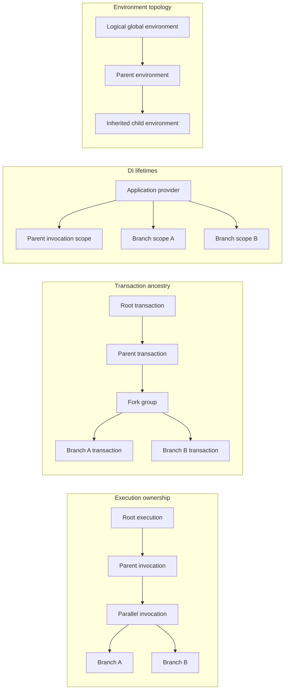
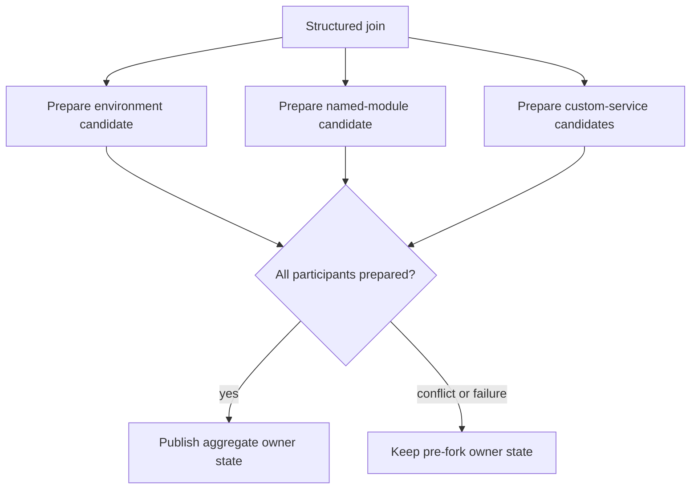

# Transactional Execution

Cyborg treats transactionality as a runtime execution primitive. Every module invocation executes inside an isolated transaction and a fresh dependency-injection scope, regardless of whether the surrounding workflow is sequential or concurrent. Nested state becomes visible to its caller only through an explicit structured join.

This model protects Cyborg-managed workflow state from scheduler-dependent mutation without pushing snapshot or merge logic into individual control-flow modules. `Sequence`, loops, conditionals, configuration modules, named-module references, and `Parallel` all use the same runtime execution boundary.

Transactions cover workflow-semantic state owned by the runtime and by services that explicitly opt into transactional participation. They do not roll back arbitrary external side effects, process-wide singleton state, or mutation inside object instances stored as environment values.

## Execution Model

Four relationships coexist during execution and serve different purposes:

- **execution ownership** defines which invocation owns nested work and when that work must terminate;
- **transaction ancestry** defines inherited workflow state, isolation, and reconciliation;
- **DI scopes** define service-object lifetime and dependency resolution;
- **environment topology** defines variable inheritance and named environment identity inside transactional state.

Execution ownership is represented by stable `ModuleExecutionId` values with explicit parent execution IDs. The identity follows the logical invocation across its runtime views, while transaction ancestry continues to define state inheritance and reconciliation. Neither relationship is inferred from CLR thread identity or ambient `ExecutionContext` propagation.



The diagram is only an ownership aid. Transaction ancestry is not inferred from DI scope nesting or runtime-object relationships, and environment inheritance is not the transaction tree.

### Loaded graphs and worker activation

Configuration loading keeps the executable graph structural. The load result contains the immutable root `ModuleContext` alongside immutable load artifacts that belong to that deserialization operation, such as the seed of discovered named-module definitions. Those artifacts are not stored on `ModuleContext` or other nodes in the module graph. A loaded module reference retains its module definition and AOT-known activation identity, not a worker instance or dependencies resolved from the provider that performed deserialization.

The distinction matters when a configuration is loaded independently at runtime: executing its load result introduces the associated artifacts into the same child transaction that executes the loaded context. Nested `ModuleContext` values that were deserialized as part of that load remain ordinary structural values; they observe the registry state established by the enclosing loaded configuration rather than carrying hidden registry state of their own.

Worker activation happens only after an invocation transaction and DI scope exist. Generated activation still performs direct, reflection-free construction, but it resolves scoped constructor dependencies from the current invocation provider. A worker can therefore keep invocation-local mutable fields such as its prepared module and result/artifact builders without those fields being shared by repeated or concurrent executions of the same loaded definition.

### Root executions

Workflow state begins at a root execution, not at the application service provider. Each root owns a parentless transaction and its own logical global environment. Multiple root executions may share normal application singletons while remaining completely independent in transaction-owned workflow state.

`Global` consequently means global within one execution tree. A root transaction has no hidden mutable backing store to commit into when execution ends; its effective state simply belongs to that execution session.

## Invocation Lifecycle

`ModuleContext` is the main invocation envelope. Executing it establishes one transaction/DI boundary around environment selection, requirements, optional configuration, and the main module lifecycle:

1. fork a child transaction from the caller's current effective state;
2. create a fresh DI scope, allocate the invocation's stable execution ID/parent ID, bind transaction-aware scoped services to the child transaction, and emit the structured `Started` lifecycle observation;
3. bind or create the logical environment selected by the context inside that transaction;
4. if execution entered through a loaded configuration result, apply its immutable named-module seed to the child transaction, then resolve required arguments and write normalized invocation-local values;
5. execute the optional configuration module as a nested child invocation and reconcile it before preparing the main module;
6. activate a fresh main worker from the invocation scope;
7. run generated preparation, validation, module lifecycle hooks, module execution, and artifact publication;
8. if a definite result exists, emit `Completed` and complete the child transaction; reconcile completed state or discard exceptional no-result state according to the caller's structured execution policy, then emit `Closed` after that structural outcome is known;
9. dispose the invocation scope only after all runtime-owned nested work has terminated.

The scope is part of the invocation contract, not a best-effort optimization. Production execution does not silently fall back to the caller or application-root service provider when an invocation scope cannot be established.

Module result status and transaction publication are separate concerns. `Success`, `Failed`, `Skipped`, and `Canceled` describe execution outcomes; they do not currently select commit versus rollback. Ordinary nested execution reconciles completed transaction state unless execution fails before reconciliation can occur or reconciliation itself fails.

`IModuleRuntime` remains the normal module-facing execution facade. Workers use it for environment access and structured nested execution rather than coordinating transaction objects or environment catalogs directly. The runtime owns the execution boundary and hides the mechanisms used for worker dispatch, environment views, artifact publication, and reconciliation.

## State Model

A transaction represents effective workflow state recursively as:

```text
immutable fork-time baseline + transaction-local changes
```

A child's baseline is the effective state of its parent at fork time. That parent state is itself its own baseline plus parent-relative changes, and the recursion ends at immutable root seed state. There is no mutable canonical workflow store beneath the transaction tree.

Only transaction-local changes are mutable. Baselines are stable and may be structurally shared between descendants, so creating branches does not require deep-copying complete workflow dictionaries or environment graphs.

### Explicit change provenance

Conflict detection is based on what a branch explicitly changed, not only on its final visible value. Once a logical location is successfully written or removed inside a transaction, that location remains part of the transaction's change provenance until the transaction terminates.

For example:

```text
baseline:            x = 1
branch operations:   set x = 2; set x = 1
visible result:      x = 1
change provenance:   x was written
```

Likewise, adding a previously absent key and then removing it still records a modification. This is necessary because an ancestor must be able to distinguish "unchanged" from "changed and restored" when reconciling concurrent descendants.

For map-like state, multiple local operations may be compacted to the final `Set` or `Remove` operation for a key, but compaction does not erase the fact that the key was modified.

## Fork Groups and Structured Ownership

Opening a fork group captures one stable effective baseline for every contributor in that generation. The owner itself is frozen for direct state mutation while the group is open; work performed after the fork belongs to an explicit continuation branch.

Contributor order is structural:

```text
fork baseline
  +-- contributor 0: owner continuation
  +-- contributor 1: child A
  +-- contributor 2: child B
  +-- ...
```

All contributors start from the same baseline. Siblings cannot observe each other's changes, and they cannot observe continuation changes before reconciliation. Task-completion timing therefore cannot change visibility or contributor ordering.

Nested fork groups are structured lifetime scopes. A branch must close its own nested groups before it can complete, and an owner cannot terminate while one of its fork groups remains open. This prevents runtime-owned child work from outliving the transaction and DI scope that own it.

Sequential nested execution uses exactly the same model with one child and an empty continuation. After the child joins, the reconciled changes remain part of the parent's parent-relative change set, so a later child forks from the updated effective state without losing provenance from earlier children.

Cancellation is a control signal rather than a merge operation. Caller cancellation propagates to runtime-owned children, but every started child is still observed before its fork closes. Cancellation may prevent reconciliation from starting; it does not permit partial publication or abandonment of invocation scopes that still own running work.

## Participants and Reconciliation

Transaction-owned workflow state is split into **participants**. A participant represents one independently transactional concern and defines that concern's root state, fork semantics, logical conflict keys, and merge-candidate construction. The transaction coordinator owns the generic topology and lifecycle around those participants.

The built-in participants are:

- the runtime environment subsystem;
- the runtime named-module registry;
- debugger branch-control state used for transaction-aware per-branch stepping;
- any custom DI service that explicitly opts into transaction participation.

Participant boundaries follow state semantics rather than runtime ownership. Unrelated concerns remain separate because the coordinator already provides aggregate atomic publication. A composite participant is appropriate only when preparing a valid candidate for one part intrinsically depends on the candidate state of another part. The environment subsystem uses this pattern because binding lifetime depends on the reconciled environment graph; the named-module registry remains separate because its state is independent. Successful semantics must not depend on participant registration or preparation order because participants cannot publish owner-visible state during preparation.

The debugger participant carries execution-control state rather than module data. Its merge is deliberately conflict-free: children inherit the owner's step flag, sibling decisions remain isolated while the fork is open, and after join the owner remains stepping when any non-stale child remains stepping. The frozen owner continuation is ignored when real child contributors exist so pre-fork step state cannot resurrect after every child explicitly continued. A debugger-session generation fences state copied into branches before `detach`; only the newest represented generation may restore stepping.

### Prepare, then publish

Reconciliation is all-or-nothing across participants:



Each participant prepares a detached candidate without mutating parent-visible state. Only after every participant has prepared successfully does the coordinator publish the complete resulting participant bundle to the owner. If any participant reports a conflict or fails during preparation, no participant candidate is published and the owner resumes from its pre-fork state.

This is why environment state, named-module state, and custom service state can remain independently designed without risking partial commits across subsystem boundaries.

### Conflict semantics

Participants define their own logical conflict keys because the transaction core does not know what constitutes one domain-state location. The default strategy rejects a fork when more than one contributor explicitly changes the same logical key, including cases where the final values happen to be equal or where two branches both remove the same key.

The owner continuation is a normal contributor for conflict purposes. A continuation and child changing the same key conflict in the same way as two sibling children.

Reads are not tracked. The current model therefore provides deterministic snapshot isolation with write/write conflict detection, not serializable database semantics.

Conflict resolution is an explicit strategy boundary. A strategy may select one conflicting contributor, but it cannot publish state itself or bypass aggregate publication. Transaction topology and atomicity remain coordinator responsibilities regardless of conflict policy.

## Transactional Runtime State

### Environment graph and bindings

Runtime environments are logical transaction-owned state, not mutable CLR objects shared through a runtime tree. Each logical environment has a stable internal identity independent of the transaction and independent of any particular `IRuntimeEnvironment` instance currently exposing it.

The environment participant owns two closely related concerns:

```text
environment participant
  graph/topology
    logical environment nodes
    inheritance relationships
    named registrations
    logical global environment

  bindings
    (environment identity, variable path) -> value / removal
```

Graph and binding state are reconciled together because topology determines which newly created environment identities remain reachable after a join. This is an intrinsic dependency within one transactional subsystem, not a general rule that related runtime state should be merged into one participant.

`IRuntimeEnvironment` instances are views over this transaction-owned graph. A view identifies one logical environment together with view-level resolution context such as namespace and override-resolution tags. Rebinding the same logical environment into another transaction creates a view over that transaction's participant state rather than aliasing a mutable dictionary from the caller.

Inherited-parent relationships preserve the parent logical identity and the view metadata required by resolution semantics. Reconstructing an inherited or named environment therefore preserves namespace and override-tag behavior without relying on the original CLR environment object remaining alive. Runtime services needed to implement environment behavior are supplied when views are materialized; service references are not stored in environment topology or transaction snapshots.

Environment scopes retain their user-facing semantics inside this model:

- `Isolated` creates a new logical node without a parent;
- `InheritParent` creates a node inheriting from the caller's current environment view;
- `InheritGlobal` creates a node inheriting from the execution's logical global environment;
- `Global`, `Parent`, and `Current` select existing logical identities through the current transaction;
- `Reference` resolves a visible named registration through the current transaction's environment graph.

Variable writes use `(environment identity, variable path)` as their logical conflict location. Different logical environments can therefore change the same variable name independently, while two views of the same logical environment conflict when they change the same binding.

Named environment registration is transaction-local. A child can immediately resolve a name it creates, while siblings continue to see the fork-time catalog until join. Competing contributors registering the same name conflict under the default strategy.

Transient child environments are not retained in ancestors merely because they existed during execution. Reconciliation keeps environments that already belonged to the owner, newly surviving named environments, and any ancestors needed to preserve the inheritance chains of those survivors. Binding changes for pruned child-local identities are discarded with those identities.

Environment values themselves remain opaque. Transactions isolate the binding from a logical path to an object; they do not clone or reconcile mutation performed inside that object after it has been stored.

### Artifact publication

Artifacts are ordinary writes into the environment participant rather than a separate transactional subsystem. A module builds its artifact collection during execution, then resolves the configured target through the current transaction's environment graph and publishes the resulting bindings there.

Targets such as `Parent`, `Current`, `Global`, and named references therefore never require direct mutation of another runtime object's live environment. Child artifacts become owner-visible only through normal reconciliation.

### Runtime named-module registry

The runtime named-module registry is a separate participant whose logical state is `module name -> immutable loaded ModuleContext`.

Configuration deserialization discovers named module definitions into immutable load-local seed data. The seed belongs to the load operation, not to any `ModuleContext` in the structural graph, and deserialization itself does not mutate runtime registry state. The configuration loader returns the root context together with those load artifacts; executing that result applies the seed to the new child transaction before requirements, optional configuration, and main-module execution. Dynamically loaded configuration files follow the same path, so their definitions become visible inside the nested execution and reconcile through normal transaction rules.

Discovery spans one complete module-configuration deserialization session. This includes `ModuleContext` values represented through `cyborg.types.module.context.v1` inside the same configuration, so a `DynamicModule` can execute such a value and resolve names discovered within it after the enclosing load result has established the registry seed. The dynamic value itself remains a plain `ModuleContext`: independently constructed or independently deserialized contexts do not carry hidden registry metadata. Code that loads executable configuration independently should therefore keep and execute the configuration load result rather than discarding its load artifacts.

Direct runtime registration and removal use the invocation-scoped module-registry facade. A change is immediately visible to the transaction that makes it, invisible to siblings until join, and visible to the owner only after successful reconciliation. The logical conflict key is the module name.

The registry remains separate from the environment participant because neither candidate depends on the other's domain state. Aggregate transaction publication still guarantees that, for example, a named-module conflict prevents otherwise-valid environment changes from becoming visible.

## Sequential and Parallel Composition

Sequential control-flow modules contain no special transaction implementation. Each nested runtime call opens a one-child fork from the caller's current effective state, executes the complete child invocation, reconciles it, and only then resumes the caller. This preserves existing sequential visibility for configuration, artifacts, named references, loops, and conditionals while using the same state model as concurrent execution.

`cyborg.modules.parallel.v1` is the multi-sibling structured-execution surface. The runtime opens one fork group for all declared branches, creates one child transaction and DI scope per branch, and starts each complete branch invocation concurrently from the same fork baseline.

Every started branch is observed before reconciliation or disposal. Results are returned in declaration order even when tasks complete in another order, and reconciliation uses the same structural contributor order. Compatible changes publish together; an unresolved conflict publishes nothing and causes `Parallel` to fail.

Branch scopes remain alive through reconciliation and are disposed only after the fork has joined or been discarded. This keeps scoped services valid for the complete structured lifetime of the branch state they participate in.

For the module's JSON contract and exit-status aggregation rules, see [Module Reference](modules-reference.md#parallel-cyborgmodulesparallelv1).

## Transaction-Aware DI Services

DI lifetime and transaction participation are orthogonal. Services generally fall into three categories:

1. **immutable or stateless application infrastructure**, which can normally remain singleton;
2. **ordinary shared mutable infrastructure**, which may remain singleton but must provide its own thread safety;
3. **workflow-semantic state**, which must inherit, isolate, and reconcile with module execution and therefore explicitly participates in transactions.

Making a service scoped does not make its state transactional, and making a singleton thread-safe does not give it snapshot isolation.

### Extension contract

A custom workflow-state service opts in through the typed transaction-aware service API:

- a singleton `TransactionalServiceParticipant<TState>` defines fresh root-state construction and stable fork semantics without storing shared mutable workflow state itself;
- its `TransactionalServiceFork<TState>` creates isolated branch state and prepares detached merge candidates;
- an ordinary scoped or transient service facade obtains an `ITransactionalServiceState<TState>` handle from the scoped `ITransactionalServiceContext`;
- each handle operation resolves the participant state currently owned by that invocation transaction;
- logical conflicts are reported through `ITransactionalServiceConflictResolver`, so the runtime's conflict strategy remains authoritative.

The facade should retain the stable state handle, not a raw state object received inside a callback. A successful child join may replace the participant state visible to the parent transaction while the parent-scoped facade itself remains alive.

Participant implementations own only their state semantics. They do not receive or manage transaction-tree objects, child joins, participant ordering, or aggregate publication. Those remain runtime responsibilities.

A participant should represent one independently transactional service concern. Atomicity with other concerns is not a reason to combine them because the coordinator already publishes all participants atomically.

Debugger branch control is a concrete built-in use of this extension model. `IDebugBranchControl` is scoped to an invocation and obtains its state through `ITransactionalServiceContext`; it does not maintain a parallel process-global map of branch IDs. Persistent breakpoint expressions and debugger-session generation remain global debugger concerns because they intentionally do not follow transaction branches.

The scoped invocation context is the routing mechanism for transaction-aware services. Normal transactional access does not use a process-wide `AsyncLocal` transaction pointer, which avoids creating a second ambient propagation mechanism alongside DI and prevents arbitrary tasks from inheriting transactional authority merely through `ExecutionContext` flow.

## State Outside Transactions

Transactions intentionally do not virtualize every mutable thing a worker can reach.

External I/O such as subprocesses, network operations, and filesystem changes cannot be undone by state reconciliation. Modules that perform such work use their ordinary failure semantics unless a higher-level compensating-action policy is introduced.

Ordinary application singletons also remain outside the transaction tree. Parallel module execution can reach them concurrently, so shared mutable implementations must be thread-safe. This is a normal concurrency requirement, not a reason to make process infrastructure transactional.

Arbitrary tasks created directly by module code are outside Cyborg's structured execution ownership. They must not outlive an invocation while retaining scoped services. Runtime-owned nested or concurrent module execution should go through `IModuleRuntime` so transaction ancestry, cancellation, reconciliation, and scope lifetime remain structured.

Environment values are another deliberate boundary: transactions protect variable bindings but do not deep-clone referenced object graphs. Shared mutable values must therefore provide their own synchronization or be treated as immutable when crossing concurrent branch boundaries.

## Architectural Guarantees and Boundaries

The steady-state model establishes these guarantees:

- loaded workflow graphs do not retain invocation-specific workers or scoped dependencies;
- every runtime-owned module invocation has its own transaction and DI scope;
- independent root executions do not share workflow-semantic state;
- every fork generation has one stable baseline shared by all contributors;
- explicit modification provenance survives nested reconciliation even when visible state returns to its baseline value;
- siblings cannot observe one another before join;
- runtime-owned child work cannot outlive its structured owner;
- participants prepare detached candidates before any owner-visible state is published;
- publication is atomic across all participants;
- default conflict handling is deterministic and based on explicit write/write conflicts;
- DI lifetime never implicitly enables transaction participation;
- debugger step state inherits, isolates, and reconciles through the same structured branch model without introducing transaction conflicts;
- external/process state remains outside the transaction model unless it explicitly participates.

The model does not currently provide:

- result-driven commit/rollback policy;
- compensating actions for external side effects;
- serializable read-set conflict detection;
- deep transactional semantics for arbitrary object graphs stored as values;
- retry-attempt selection or managed background/sidecar execution policy;
- richer merge policies beyond the existing conflict-strategy boundary;
- interactive selection or switching of the active debugger frontend among already-queued pause points;
- persistence or export policy for final root transaction state.

These are policy or product extensions over the same invocation and reconciliation boundaries. They should not require a second workflow-state model or different worker/DI lifetime semantics.
