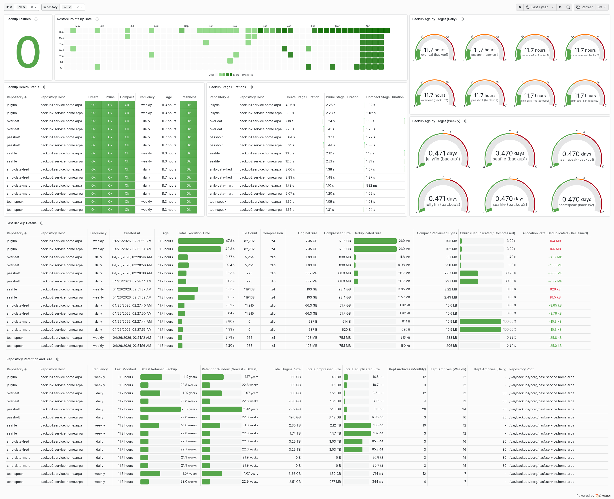

# BorgBackup Orchestration with Cyborg

This directory contains a production-ready reference deployment that uses Cyborg to orchestrate [BorgBackup](https://www.borgbackup.org/) across multiple remote repositories, entirely from declarative JSON configuration. No backup scripts, no procedural glue code.

The sample models a real-world scenario: a Linux server backing up Docker containers and systemd services to two remote borg hosts that may be powered off between runs. Cyborg handles the full lifecycle: waking remote hosts, stopping services for data consistency, creating and managing borg archives across every repository, restarting services, shutting down hosts it woke, and exporting Prometheus metrics. All of this is expressed as composable modules in JSON.

## What This Demonstrates

### End-to-End Workflow Orchestration

A single `cyborg run -e target=daily` triggers a multi-stage pipeline:

1. **Wake backup hosts** via Wake-on-LAN with liveness probes
2. **Discover jobs** by globbing `.jconf` files from the target frequency directory
3. **For each job:** stop the service, run borg create/prune/compact on every host, restart the service
4. **Shut down** any remote host that was woken in step 1
5. **Export** Prometheus metrics

This is defined in [`cyborg.jconf`](cyborg.jconf), the main entry point, using sequences, guards, loops, conditionals, and environment references. No orchestration logic lives outside the configuration.

### Guaranteed Service Recovery

Every service stop is wrapped in a [guard](../docs/architecture/modules-reference.md#guard-cyborgmodulesguardv1) with a `finally` block. Whether borg succeeds, fails, or is cancelled, the service is restarted:

```jsonc
// From the Docker backup template
{
  "cyborg.modules.guard.v1": {
    "try": {
      // stop container, borg create/prune/compact on each host
    },
    "finally": {
      // docker compose up -d (always runs)
    }
  }
}
```

The same pattern applies at the top level: remote hosts woken via Wake-on-LAN are shut down in a `finally` block, even if the entire job run fails.

### Template-Driven Reuse

Job files don't implement backup logic. They invoke a shared [template](../docs/architecture/templates-reference.md) and supply only what varies: the service name, borg operations, and retention policy. Three templates cover all cases:

| Template | Lifecycle | Used By |
|----------|-----------|--------|
| `docker-backup-template` | compose down -> borg -> compose up | Overleaf, Passbolt, Jellyfin, Seafile, TeamSpeak |
| `systemd-backup-template` | systemctl stop -> borg -> systemctl start | (available for systemd-managed borg services) |
| `systemd-template` | systemctl stop -> *caller-defined body* -> systemctl start | Samba (SMB shares) |

A Passbolt backup job is just a template invocation with four arguments (container name, create/prune/compact config):

```jsonc
// jobs/daily/passbolt.jconf (simplified)
{
  "module": {
    "cyborg.modules.template.v1": {
      "path": "${cyborg_template_root}/docker-backup-template.jconf",
      "arguments": [
        { "key": "container_name", "string": "passbolt" },
        { "key": "borg_create", "cyborg.types.module.context.v1": {
            "module": { "cyborg.modules.borg.create.v1.4": {
                "archive_name": "${container_name}-{now}",
                "source_path": "${volume_root}",
                "compression": "zlib"
            }}
        }},
        { "key": "borg_prune", "cyborg.types.module.context.v1": {
            "module": { "cyborg.modules.borg.prune.v1.4": {
                "glob_archives": "${container_name}-*",
                "keep": { "daily": 30, "weekly": 24, "monthly": 48 }
            }}
        }},
        { "key": "borg_compact", "cyborg.types.module.context.v1": {
            "module": { "cyborg.modules.borg.compact.v1.4": {} }
        }}
      ]
    }
  }
}
```

### Modules as Data

The borg create, prune, and compact operations aren't hardcoded in the template. Instead, they're passed in as arguments of type `cyborg.types.module.context.v1` and executed at runtime via the [Dynamic module](../docs/architecture/modules-reference.md#dynamic-cyborgmodulesdynamicv1). This means templates don't know which borg operations they'll run; the caller decides. The template only provides the orchestration scaffold (stop service, iterate hosts, configure repositories, restart service) while the actual backup operations are injected.

### Automatic Job Discovery

The main workflow globs `.jconf` files from the target job directory at runtime:

```jsonc
// From cyborg.jconf (the try block)
{
  "cyborg.modules.glob.v1": {
    "root": "${cyborg_job_root}/${target}/",
    "pattern": ".*?\\.jconf$"
  }
}
// Then iterates the results via foreach + external module loading
```

Drop a new `.jconf` file into `jobs/daily/` and it's picked up on the next daily run. No manifest, no registration.

### Wake-on-LAN with Stateful Cleanup

Remote backup hosts may be powered off between runs. Before executing jobs, Cyborg wakes each host via WoL with a liveness probe (SSH port check). The wake status is published to a named `wol` environment with per-host namespacing. After all jobs complete, the `finally` block checks each host's wake state and only shuts down hosts that Cyborg actually woke, leaving already-running hosts untouched.

### Security

Cyborg's trust subsystem audits file ownership and permissions before deserializing any configuration. The sample [`cyborg.options.jconf`](cyborg.options.jconf) enforces that all configuration files are root-owned and not group/other-writable. Secrets files (`.jsecrets`) should be mode `600`.

### Monitoring

Cyborg exports Prometheus metrics for every borg operation. The `grafana/` directory includes a ready-to-import dashboard covering operational health and storage efficiency across all repositories and hosts:



See [Monitoring Setup](#monitoring-setup) below for details on what each panel tracks.

## Sample Jobs

| Job | Service Type | Frequency | Compression | Retention | Notes |
|-----|-------------|-----------|-------------|-----------|-------|
| `overleaf` | Docker | Daily | zlib | 30d / 12w / 12m | Excludes mongo diagnostics and sharelatex caches |
| `passbolt` | Docker | Daily | zlib | 30d / 24w / 48m | Full volume backup |
| `smb-data` | systemd | Daily | zlib | 30d / 24w / 24m | Multi-target; globs share configs from `smb-targets/` |
| `jellyfin` | Docker | Weekly | lz4 | 12w / 12m | Excludes logs and temp |
| `seafile` | Docker | Weekly | lz4 | 12w / 12m | Excludes logs and HTTP temp |
| `teamspeak` | Docker | Weekly | lz4 | 7w / 12m | Excludes logs |

## Getting Started

### Prerequisites

- A built Cyborg binary (see [Building](../README.md#building))
- [BorgBackup](https://www.borgbackup.org/) v1.4.x on the server and all remote hosts
- SSH key-based access to remote repository hosts
- Initialized borg repositories on each remote host

### 1. Deploy Configuration

```bash
sudo mkdir -p /etc/cyborg
sudo cp -r samples/* /etc/cyborg/
```

### 2. Configure Host Secrets

```bash
sudo cp /etc/cyborg/cyborg.hosts.jsecrets.sample /etc/cyborg/cyborg.hosts.jsecrets
```

Edit `cyborg.hosts.jsecrets` with your actual values: hostnames, SSH ports, WoL MAC addresses, borg usernames, and repository paths. Each service also needs a per-container secrets file (e.g., `jobs/daily/overleaf.jsecrets`) containing its borg passphrase.

### 3. Lock Down Permissions

Cyborg's trust subsystem requires configuration files to be root-owned and not group/other-writable:

```bash
sudo chown -R root:root /etc/cyborg
sudo chmod -R go-w /etc/cyborg
sudo chmod 600 /etc/cyborg/cyborg.hosts.jsecrets
sudo chmod 600 /etc/cyborg/jobs/**/*.jsecrets
```

### 4. Initialize Repositories

Create a borg repository on each remote host for every service:

```bash
borg init --encryption=repokey ssh://borg@backup1.service.local/var/backups/borg/my.client.local/overleaf
borg init --encryption=repokey ssh://borg@backup2.service.local/var/backups/borg/my.client.local/overleaf
# Repeat for each service...
```

### 5. Install and Run

```bash
sudo mkdir -p /opt/cyborg/bin
sudo cp cyborg /opt/cyborg/bin/cyborg
sudo chmod +x /opt/cyborg/bin/cyborg

# Test a manual run
cyborg run --main /etc/cyborg/cyborg.jconf --options /etc/cyborg/cyborg.options.jconf -e target=daily
```

### 6. Schedule with Cron

```bash
sudo cp -r samples/cron/ /opt/cyborg/cron/
sudo chmod +x /opt/cyborg/cron/*.sh /opt/cyborg/cron/*.cron
sudo ln -s /opt/cyborg/cron/daily.borg.cron /etc/cron.daily/borg-backup
sudo ln -s /opt/cyborg/cron/weekly.borg.cron /etc/cron.weekly/borg-backup
sudo ln -s /opt/cyborg/cron/monthly.borg.cron /etc/cron.monthly/borg-backup
```

The cron runner (`run-borg.sh`) acquires an exclusive file lock to prevent concurrent runs and validates the frequency argument before invoking Cyborg.

## Adding a New Backup Job

To back up a new Docker container (e.g., Gitea on a daily schedule):

**1. Create the job file** (`jobs/daily/gitea.jconf`):

```jsonc
{
  "environment": { "name": "gitea", "scope": "inherit_parent", "transient": true },
  "requires": {
    "arguments": [ "docker_root", "docker_user", "backup_hosts", "job_directory", "cyborg_template_root" ]
  },
  "module": {
    "cyborg.modules.template.v1": {
      "namespace": "cyborg.template.backup-job.docker.v1",
      "path": "${cyborg_template_root}/docker-backup-template.jconf",
      "arguments": [
        { "key": "container_name", "string": "gitea" },
        { "key": "borg_create", "cyborg.types.module.context.v1": {
            "module": { "cyborg.modules.borg.create.v1.4": {
                "archive_name": "${container_name}-{now}",
                "source_path": "${volume_root}",
                "compression": "zlib",
                "exclude": { "caches": true, "paths": [ "*/log/*" ] }
            }}
        }},
        { "key": "borg_prune", "cyborg.types.module.context.v1": {
            "module": { "cyborg.modules.borg.prune.v1.4": {
                "glob_archives": "${container_name}-*",
                "keep": { "daily": 30, "weekly": 12, "monthly": 12 }
            }}
        }},
        { "key": "borg_compact", "cyborg.types.module.context.v1": {
            "module": { "cyborg.modules.borg.compact.v1.4": {} }
        }}
      ]
    }
  }
}
```

**2. Create the secrets file** (`jobs/daily/gitea.jsecrets`):

```json
{
  "module": {
    "cyborg.modules.config.map.v1": {
      "entries": [
        { "key": "borg_passphrase", "string": "your-borg-passphrase-here" }
      ]
    }
  }
}
```

**3. Initialize repositories and set permissions:**

```bash
borg init --encryption=repokey ssh://borg@backup1.service.local/var/backups/borg/my.client.local/gitea
sudo chown root:root /etc/cyborg/jobs/daily/gitea.*
sudo chmod 600 /etc/cyborg/jobs/daily/gitea.jsecrets
```

The new job is automatically discovered on the next daily run. No changes to `cyborg.jconf` are needed.

## Monitoring Setup

Cyborg exports metrics in [Prometheus exposition format](https://prometheus.io/docs/instrumenting/exposition_formats/) to the path configured in `cyborg.options.jconf` (default: `/var/log/cyborg/metrics.prom`).

**Scraping:** Use [node_exporter's textfile collector](https://github.com/prometheus/node_exporter#textfile-collector) to ingest the `.prom` files into Prometheus.

**Dashboard:** Import `grafana/cyborg-borg-backup-dashboard.json` into Grafana and point it at your Prometheus data source. The dashboard is filterable by hostname and repository and includes the following panels:

- **Backup Failures:** stat panel counting create, prune, and compact stages whose most recent run failed. Zero means all stages last succeeded.
- **Backup Health Status:** per-repository table showing the latest success/failure state for each stage (create, prune, compact) and a freshness indicator that evaluates whether the backup age is acceptable for the configured frequency.
- **Restore Points by Date:** visualizes which backup dates are still present in the repository after pruning. Useful for verifying retention patterns and spotting gaps in daily, weekly, or monthly coverage.
- **Backup Age by Target:** separate daily (hours) and weekly (days) gauge panels showing time since the latest backup per repository and host. Highlights overdue backups.
- **Backup Stage Durations:** time-series table of create, prune, and compact durations per repository and host. Identifies slow repositories and which stage dominates runtime.
- **Last Backup Details:** latest archive metadata per repository: timestamp, age, file count, original/compressed/deduplicated sizes, compression algorithm, total execution time, compact reclaimed bytes, churn ratio (deduplicated/compressed), and allocation rate (deduplicated minus reclaimed).
- **Repository Retention and Size:** repository-level table with oldest retained backup age, retention window span, last modified time, total original/compressed/deduplicated sizes, kept archive counts by rule (daily/weekly/monthly), and repository root path.

## File Reference

| File | Purpose |
|------|---------|
| `cyborg.jconf` | Main workflow: WoL, job discovery, guard/finally cleanup |
| `cyborg.options.jconf` | Trust policies, logging (console/file/rolling), Prometheus metrics |
| `cyborg.hosts.jsecrets.sample` | Template for host secrets (hostnames, WoL MACs, borg credentials) |
| `templates/docker-backup-template.jconf` | Docker backup lifecycle: compose down -> borg -> compose up |
| `templates/systemd-backup-template.jconf` | systemd backup lifecycle: stop -> borg -> start |
| `templates/systemd-template.jconf` | Generic systemd lifecycle with caller-defined body |
| `jobs/daily/*.jconf` | Daily backup jobs (Overleaf, Passbolt, SMB) |
| `jobs/weekly/*.jconf` | Weekly backup jobs (Jellyfin, Seafile, TeamSpeak) |
| `cron/run-borg.sh` | Cron runner with flock and argument validation |
| `cron/*.cron` | Frequency-specific cron entry points |
| `grafana/` | Grafana dashboard definition and screenshot |

## Further Reading

- [Architecture Overview](../docs/architecture/architecture-overview.md): module system, runtime, environment scoping
- [Module Reference](../docs/architecture/modules-reference.md): all built-in modules including Borg modules
- [Templates Reference](../docs/architecture/templates-reference.md): template system and patterns
- [Dynamic Values Reference](../docs/architecture/dynamic-values-reference.md): typed collections and dynamic value providers
